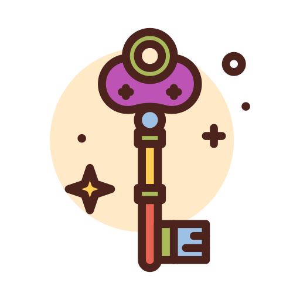

<h1 align="center">
  <br>
  
  <br>
  Mahina Bot - Advanced AI-Powered Discord Music & Assistant Bot 🎧
  <br>
</h1>

<p align="center">
  <strong>A sophisticated Discord bot featuring NVIDIA AI integration, advanced music playback, and intelligent conversations</strong>
</p>

<p align="center">
  
  
  
  
  
  <a href="https://github.com/gabrielmaialva33/mahina-bot/commits/master">
    
      
  </a>
</p>

<br>

<p align="center">
  <a href="#sparkles-features">Features</a>&nbsp;&nbsp;&nbsp;|&nbsp;&nbsp;&nbsp;
  <a href="#rocket-nvidia-ai-integration">NVIDIA AI</a>&nbsp;&nbsp;&nbsp;|&nbsp;&nbsp;&nbsp;
  <a href="#computer-technologies">Technologies</a>&nbsp;&nbsp;&nbsp;|&nbsp;&nbsp;&nbsp;
  <a href="#package-installation">Installation</a>&nbsp;&nbsp;&nbsp;|&nbsp;&nbsp;&nbsp;
  <a href="#gear-configuration">Configuration</a>&nbsp;&nbsp;&nbsp;|&nbsp;&nbsp;&nbsp;
  <a href="#electric_plug-commands">Commands</a>&nbsp;&nbsp;&nbsp;|&nbsp;&nbsp;&nbsp;
  <a href="#memo-license">License</a>
</p>

<br>

## :sparkles: Features

### Advanced Music System 🎵
- **High-Quality Playback** - Powered by Lavalink for superior audio streaming
- **Multi-Platform Support** - YouTube, Spotify, SoundCloud, Apple Music, Deezer, and more
- **Advanced Queue Management** - Shuffle, loop, skip, pause, and volume control
- **Playlist Support** - Create, save, and manage custom playlists
- **Audio Filters** - 10+ audio filters including bass boost, nightcore, vaporwave
- **Live Stream Support** - Play live streams and radio stations
- **Video Streaming** - Stream videos directly in Discord voice channels

### NVIDIA AI Integration 🤖
- **Multiple AI Models** - Access to cutting-edge NVIDIA models:
  - **Llama 4 Maverick** - General purpose multimodal model
  - **DeepSeek R1** - Advanced reasoning and analysis
  - **Qwen 2.5 Coder** - Specialized programming assistant
  - **Llama 3.x Series** - Various sizes for different needs
- **Intelligent Conversations** - Context-aware chat with memory and personality
- **Code Analysis & Generation** - Write, review, debug, and optimize code
- **Advanced Reasoning** - Solve complex problems with step-by-step analysis
- **Streaming Responses** - Real-time AI responses for better interactivity
- **Multi-Modal Support** - Process text and images (vision models)

### 🧠 AI Memory & Context System
- **User Memory** - Remembers preferences, interests, and interaction patterns
- **Conversation Context** - Maintains context across messages for coherent discussions
- **Personality System** - 8 different AI personalities (Friendly, Professional, Playful, DJ, Wise, Technical, Gamer, Teacher)
- **Learning System** - Learns from user interactions to provide better responses
- **Sentiment Analysis** - Understands user emotions and responds appropriately

### 🛠️ Bot Management
- **Multi-Language Support** - 8+ languages including English, Portuguese, Spanish, French, German
- **Custom Prefix** - Configurable command prefix per server
- **Permission System** - Granular permission control for commands
- **Database Integration** - MongoDB/Prisma for persistent data storage
- **Dashboard** - Web interface for bot configuration (optional)
- **Auto-Restart** - PM2 support for production deployments

### 📊 Additional Features
- **78 Total Commands** - Organized into 10 categories
- **Slash Command Support** - Modern Discord slash commands
- **Button & Menu Interactions** - Interactive UI components
- **Error Handling** - Robust error handling and logging
- **Performance Monitoring** - Built-in stats and monitoring
- **Developer Tools** - Eval, shell, and other dev commands

<br>

## :rocket: NVIDIA AI Integration

Mahina Bot leverages NVIDIA's powerful AI models through their API to provide intelligent assistance:

### Available Models

| Model              | Use Case                            | Context Length | Features                    |
|--------------------|-------------------------------------|----------------|-----------------------------|
| **DeepSeek R1**    | Advanced reasoning, problem-solving | 8,192 tokens   | Step-by-step analysis       |
| **Qwen 2.5 Coder** | Programming, code review            | 32,768 tokens  | Code generation & debugging |
| **Llama 3.3 70B**  | General conversations               | 128,000 tokens | Balanced performance        |
| **Llama 3.1 70B**  | Streaming chat                      | 128,000 tokens | Real-time responses         |

### AI Commands

```bash
# Chat with AI
!chat <message>                  # General AI chat
!mahinai <message>               # Enhanced AI with memory and context
!reason <problem>                # Advanced reasoning for complex problems
!code <task> <language>          # Code generation and analysis
!stream <message>                # Streaming AI responses
!model list                      # View available AI models
!model select <model>            # Switch AI model
!aistatus                        # View your AI usage stats
```

### Example AI Usage

```javascript
// Code generation example
const invokeUrl = "https://integrate.api.nvidia.com/v1/chat/completions";

const payload = {
  "model": "meta/llama-4-maverick-17b-128e-instruct",
  "messages": [{"role":"user","content":"Your message here"}],
  "max_tokens": 512,
  "temperature": 1.00,
  "stream": false
};
```

<br>

## :computer: Technologies

- **[TypeScript](https://www.typescriptlang.org/)** - Type-safe JavaScript
- **[Node.js](https://nodejs.org/)** - JavaScript runtime
- **[Discord.js](https://discord.js.org/)** - Discord API wrapper
- **[Lavalink](https://github.com/lavalink-devs/Lavalink)** - Audio streaming server
- **[Prisma](https://www.prisma.io/)** - Modern database ORM
- **[MongoDB](https://www.mongodb.com/)** - NoSQL database
- **[NVIDIA AI](https://www.nvidia.com/en-us/ai/)** - AI models and inference
- **[Docker](https://www.docker.com/)** - Containerization

<br>

## :package: Installation

### Prerequisites

- **[Node.js](https://nodejs.org/)** (v22.11.0+)
- **[Git](https://git-scm.com/)**
- **[Docker](https://www.docker.com/)** & **[Docker Compose](https://docs.docker.com/compose/)**
- **[MongoDB](https://www.mongodb.com/)** (or use Docker)
- **[Lavalink](https://github.com/lavalink-devs/Lavalink)** (or use Docker)

### Quick Start

1. **Clone the repository**
```bash
git clone https://github.com/gabrielmaialva33/mahina-bot.git
cd mahina-bot
```

2. **Install dependencies**
```bash
pnpm install
# or npm install
```

3. **Configure environment**
```bash
cp .env.example .env
# Edit .env with your configuration
```

4. **Start services with Docker**
```bash
docker-compose up -d
```

5. **Run database migrations**
```bash
pnpm db:push
```

6. **Start the bot**
```bash
pnpm build && pnpm start:max
# or for development
pnpm start:dev
```

<br>

## :gear: Configuration

### Environment Variables

Create a `.env` file with the following configuration:

```env
# Discord Configuration
TOKEN=your_discord_bot_token
CLIENT_ID=your_discord_client_id

# Database
DATABASE_URL=mongodb://localhost:27017/mahina

# Lavalink Nodes
NODES=[{"id":"main","host":"localhost","port":2333,"authorization":"youshallnotpass"}]

# AI Configuration
NVIDIA_API_KEY=your_nvidia_api_key  # Get from build.nvidia.com
OPENAI_API_KEY=your_openai_api_key  # Optional fallback

# Bot Settings
PREFIX=!
DEFAULT_LANGUAGE=EnglishUS
BOT_ACTIVITY=Music & AI
BOT_STATUS=online

# Optional Features
GENIUS_API=your_genius_api_key       # For lyrics
TOPGG=your_topgg_token              # For bot lists
PORT=3050                           # Web dashboard port
```

### Docker Compose

The included `docker-compose.yml` provides:
- Lavalink server
- MongoDB database
- Optional: Bot container

<br>

## :electric_plug: Commands

### 🎵 Music Commands
- `play`, `pause`, `resume`, `stop`, `skip`, `previous`
- `queue`, `nowplaying`, `shuffle`, `loop`, `volume`
- `seek`, `replay`, `remove`, `clear`, `jump`
- `grab`, `move`, `skipto`, `lyrics`

### 🤖 AI Commands
- `chat`, `mahinai`, `code`, `reason`, `stream`
- `model`, `aistatus`, `vision`, `tools`

### 🎛️ Filter Commands
- `filter`, `bassboost`, `nightcore`, `vaporwave`
- `8d`, `distortion`, `karaoke`, `tremolo`, `vibrato`

### 📋 Playlist Commands
- `playlist create`, `playlist add`, `playlist remove`
- `playlist list`, `playlist load`, `playlist delete`

### ⚙️ Config Commands
- `prefix`, `language`, `setup`, `reset`
- `247`, `autoplay`, `voteskip`

### ℹ️ Info Commands
- `help`, `info`, `invite`, `ping`, `stats`
- `node`, `lavalink`, `support`

### 💿 Stream Commands
- `live`, `radio`, `video`, `twitch`
- `mixer`, `podcast`, `soundcloud`

### 👑 Developer Commands
- `eval`, `shell`, `reload`, `restart`
- `blacklist`, `maintenance`, `simulate`

<br>

## :books: API Integration Example

### Using NVIDIA AI in Your Code

```typescript
import { NvidiaAIService } from './services/nvidia_ai_service';

// Initialize service
const aiService = new NvidiaAIService(process.env.NVIDIA_API_KEY);

// Chat with AI
const response = await aiService.chat(
  userId,
  "Explain quantum computing",
  "Make it simple for beginners"
);

// Generate code
const code = await aiService.analyzeCode(
  userId,
  "function fibonacci(n) { return n <= 1 ? n : fibonacci(n-1) + fibonacci(n-2); }",
  "javascript",
  "optimize"
);

// Stream responses
for await (const chunk of aiService.chatStream(userId, message)) {
  console.log(chunk); // Print each chunk as it arrives
}
```

<br>

## :memo: License

This project is under the **MIT** license. See [LICENSE](./LICENSE) for details.

<br>

## :handshake: Contributing

Contributions are welcome! Please feel free to submit a Pull Request.

1. Fork the project
2. Create your feature branch (`git checkout -b feature/AmazingFeature`)
3. Commit your changes (`git commit -m 'Add some AmazingFeature'`)
4. Push to the branch (`git push origin feature/AmazingFeature`)
5. Open a Pull Request

<br>

## :star: Support

If you find this project helpful, please give it a star ⭐ to help others discover it!

<br>

## :busts_in_silhouette: Author

Made with ❤️ by **Maia** - A passionate developer who loves cats (but is definitely not one!)

- 📧 Email: [gabrielmaialva33@gmail.com](mailto:gabrielmaialva33@gmail.com)
- 💬 Telegram: [@mrootx](https://t.me/mrootx)
- 🐙 GitHub: [@gabrielmaialva33](https://github.com/gabrielmaialva33)

<br>

<p align="center">
  
</p>

<p align="center">
  &copy; 2017-present <a href="https://github.com/gabrielmaialva33/" target="_blank">Maia</a>
</p>
